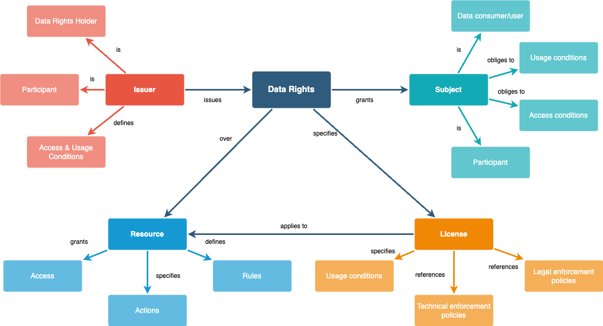

# Introduction
--------------

Data rights holders play an important role in data economy as they sit on a lot of data which is currently not shared for various reasons. Enabling the data rights holders with proper tools and mechanisms for controlled sharing of data has potential to unlock the data economy. Regulators worldwide are introducing various regulations which are aimed to enable data rights holders to share data while maintainting data soverigenity.


## About Data Rights

This chapter explains the data rights and the following model shows the relations with data rights holder and access subject and elements of the data rights.



## About Data Rights policies profile

The data rights policy profile defines the base model and schema for data rights that is aimed to standardise how data rights are expressed in exchange by data rights holders towards the access subject.

## Data rights schema

The data rights holder may choose to implement its own or procure a complaint service to manage its rights. The implementation may vary, however, for consumer and provider there must be a evidence token in specific format for interoperability. This token is also called as delegation evidence. This token must be complaint to following specifications:


````
{
  "$schema": "http://json-schema.org/draft-07/schema#",
  "type": "object",
  "properties": {
    "delegationEvidence": {
      "type": "object",
      "properties": {
        "policyIssuer": {
          "type": "string"
        },
        "target": {
          "type": "object",
          "properties": {
            "accessSubject": {
              "type": "string"
            }
          },
          "required": ["accessSubject"]
        },
        "policySets": {
          "type": "array",
          "items": {
            "type": "object",
            "properties": {
              "target": {
                "type": "object",
                "properties": {
                  "environment": {
                    "type": "object",
                    "properties": {
                      "licenses": {
                        "type": "array",
                        "items": {
                          "type": "string"
                        }
                      }
                    },
                    "required": ["licenses"]
                  }
                },
                "required": ["environment"]
              },
              "policies": {
                "type": "array",
                "items": {
                  "type": "object",
                  "properties": {
                    "target": {
                      "type": "object",
                      "properties": {
                        "resource": {
                          "type": "object",
                          "properties": {
                            "type": {
                              "type": "string"
                            },
                            "identifiers": {
                              "type": "array",
                              "items": {
                                "type": "string"
                              }
                            },
                            "attributes": {
                              "type": "array",
                              "items": {
                                "type": "string"
                              }
                            }
                          },
                          "required": ["type", "identifiers", "attributes"]
                        },
                        "actions": {
                          "type": "array",
                          "items": {
                            "type": "string"
                          }
                        }
                      },
                      "required": ["resource", "actions"]
                    },
                    "rules": {
                      "type": "array",
                      "items": {
                        "type": "object",
                        "properties": {
                          "effect": {
                            "type": "string",
                            "enum": ["Permit", "Deny"]
                          }
                        },
                        "required": ["effect"]
                      }
                    }
                  },
                  "required": ["target", "rules"]
                }
              }
            },
            "required": ["target", "policies"]
          }
        }
      },
      "required": ["policyIssuer", "target", "policySets"]
    }
  },
  "required": ["delegationEvidence"]
}
````


## Schema Elements:

### Delegation Evidence (`delegationEvidence`):

A delegation evidence is a credential proving that `policyIssuer` has granted rights to access subject on a (data) `resource` that issuer is rights holder of. In addition, it specifies the conditions for access and/or usage of the (data) `resource` for the `accessSubject`.

### Policy issuer (`policyIssuer`):

A participant who is data rights holder in the context of the data sharing transaction and is issuing the rights to the `accessSubject` over the `resource` it has right to. In addition it specifies the *Data License* or just *License* which defines what the `accessSubject` can do with the data it recevices access to.

### Access Subject (`accessSubject`):

A participant who is the counter party in the contract to whom access to `resource` is granted by the data rights holder(`policyIssuer`). The access subject is obliged to use the `resource` in accordance with the data usage `licences` given in the `delegationEvidence`.

### Policy Sets (`policySets`):

An `policyIssuer` shall be able to define multiple Data Rights policies, for a given `accessSubject`, defining access and usage rights over different resources. Each set is defined under `items` as an object

### Policy Set Items (`items`):

An object defining the various attributes about the access and usage conditions over a `resource`.

  #### Target (`target`):

  Target is a container for attributes that define conditions and/or obligations for the `accessSubject` over the resources defined in the `policies`.

  #### Environment (`environment`):

  Environment is a container for attributes that define the obligations for the `accessSubject` that it MUST take care of when handling the `resource`. If the environemntal conditions are not inline with the attributes defined, then `accessSubject` MUST not process the `resource` or perform actions over the `resource`.

  #### Licences (`licences`):

  Licences defines the usage conditions over the `resource` defined in the policy within the `degelationEvidence` that `policyIssuer` has specified for `accessSubject`. `accessSubject` is obligated to comply with the licences. It is an array of attributes that define various parameters of a licence.

### Policies (`policies`):

Policies is a container for defining the resources and the access conditions that apply to them. It is an array of `items` object

  #### Policy items (`items`):

  Items is an object that defines the resources and access conditions that apply to those resources.

  #### Target (`target`):

  Target is an object that defines the resources and actions over the resources that the rules applies to.

  #### Resource (`resource`):

  Resource is an object that defines the (data) resource over which the access and usage conditions are defined. These combination of resource and access and usage conditions helps the `policyIssuer` to define *Data Rights* for `accessSubject`. The resource is deducible based on the attributes defined.

  #### Type (`type`):

  Type specifies the type of the `resource` which is unambigousaly understandable and interpretable by parties involved in the transaction and is specified in the contract. 

  #### Identifiers (`identifiers`):

  Identifiers is an array of `resource` identifiers that uniquely identifies specific resources. 

  #### Attributes (`attributes`):

  Attributes are the `resource` attributes to which this policy applies. This specifies the data points of the resource and thereby allows `policyIssuer` to excercise control over each data point. 

  #### Actions (`actions`):

  Actions are keywords that are unambigousaly understandable and interpretable by the parties involved in the tractions over the actions that can be performed by the `accessSubject` over the `resource`.

  #### Rules (`rules`):

  Rules are the permit or deny rules that applies over `resource` specified. Rules allows the `policyIssuer` to grant rights over `resource` to `accessSubject`.


## References:

[iSHARE Framework](https://ishare.eu): An important element in order to acheive that is introduction of a trust framework which encompases right aspects not only from technical point of view but also business, legal and privacy point of views. An example of such a trust framework is [iSHARE Framework](https://ishare.eu), while there are other initiatives focusing on addressing some of the specific other aspects.