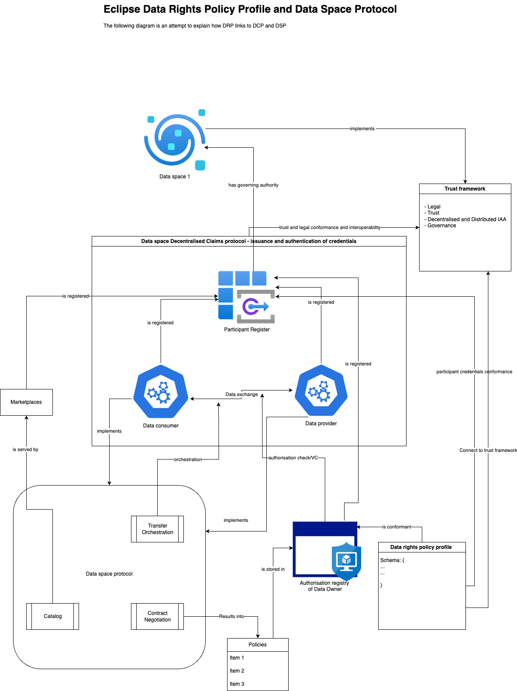

# Data Rights Policy Profile
The Dataspace Data Rights Policy Profile contains specifications for data rights holders in context of data ecosystems, enabling them to excercise their data rights

## Introduction

Data rights holders play an important role in data economy as they sit on a lot of data which is currently not shared for various reasons. Enabling the data rights holders with proper tools and mechanisms for controlled sharing of data has potential to unlock the data economy. Regulators worldwide are introducing various regulations which are aimed to enable data rights holders to share data while maintainting data soverigenity.

## Scope

## Base Concepts

### 

Data sharing requires data rights holders to specify policies for access and usage control. Various providers may work and provide services using specific policy languages or its own way of implementations. This approach works as long as it is meant for same applications or applications using same standards from interoperability perspectives. However, we often encounter that not everyone uses the same standards or same applications and it deviates more when its across sectors. The data rights policy profile is aimed at creating the standard for exchanging the authorisation information so that service providers can simply use this information to evaluate authorisations without bothering to implement policy language specific implementations. This will enable interoprability across the providers and allow usage of different policy languages.

Further it enables data rights holders to select any service provider irrespective of the policy language they implement as long as they are compliant to this standard. It also facilitates portability for data rights holders from one provider to another as determined in Data Act under the European data strategy.

The data rights holders ofcourse can delegate this responsibility to service providers, but irrespectively they must first do it themselves.

## How does Profile bring the Dataspace Protocols together

As you are aware of the layering structure of the specification projects under Eclipse Dataspace Working group where protocols forms the basis for the data exchange while the profiles are making it possible by defining the requirements and schema definitions. It does not stop there, it further makes it possible to connect to trust frameworks, thereby enabling the participants to perform trusted data sharing. 

### Dataspace protocol and data rights policy profile

The contract negotiation component from dataspace protocol results into a contract when the negotiation reaches `FINALIZED` state. The contract contains the necessary elements that define who the `AccessSubject` is to whom the `issuer` issued access to specific `resource` (data) for which negotiation occured. This forms the authorisation for the *consumer* to perform *action* over the *resource*. 
In addition to that the contract may also contain the conditions which *consumer* must adhear to when using or handling (*performing the action on*) the *resource* (data). This is called the usage conditions. 